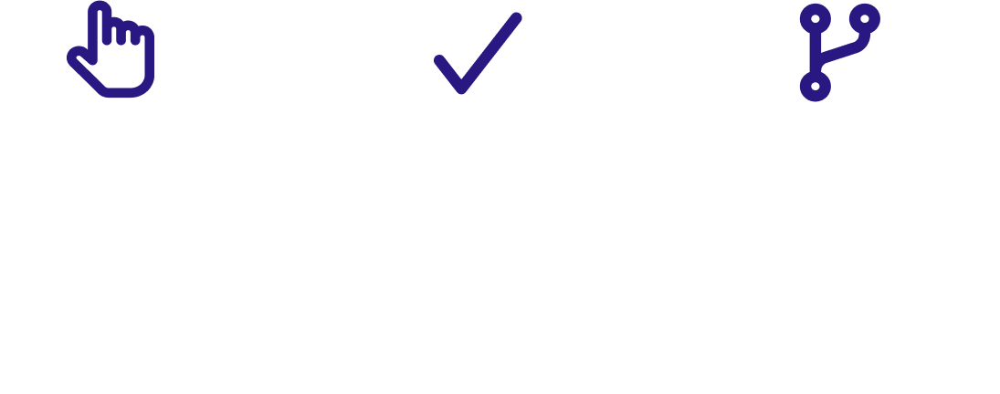

# Plan Mini proyectos

Este proyecto se realiza con el fin de mejorar y aumentar conocimientos y capacidades a la hora de desarrollar proyectos con javascript 


## Instrucciones



## Requerimientos

Para el correcto desarrollo, en el proyeco se debe evidenciar el manejo de los siguientes temas

 - [Manupulacion de objetos ](https://developer.mozilla.org/es/docs/Web/JavaScript/Guide/Working_with_Objects)
 - [Persistencia -- localStorage](https://developer.mozilla.org/es/docs/Learn/JavaScript/Client-side_web_APIs/Client-side_storage)
 - [Responsive desing](https://developer.mozilla.org/es/docs/Learn/CSS/CSS_layout/Responsive_Design)
  - [Manupulacion de DOM](http://juanmirod.github.io/2019/06/24/chuleta-dom.html)


## Recomendaciones

- Publique su proyecto en gitHub de manera publica
- invite a las siguientes personas:

   - Felipe castillo -- fcastillo@serempre.com
   - Sammy Guttman -- sguttman@serempre.com 
   - Diana Paez -- dpaez@serempre.com 

tenga en cuenta las siguientes recomendaciones al momento de publicar y realizar sus cambios 

 - [Manejo de ramas](https://docs.serempre.com/en/operations/development/frontend/git/generals/es)
 - [Nomenclatura de commits (Nomenclatura Serempre Commits)](https://docs.serempre.com/en/operations/development/frontend/git/nomenclature)
  - [Pull request](https://docs.serempre.com/en/operations/development/frontend/git/generals/es)


una vez finalizado o tenga un avance significativo debera realizar un pull request solicitando la revision de su codigo, para asi aceptarlo o dar correccciones sobre este.


## Proyectos ejemplo

Puede seleccionar unos de estos proyectos o proponer uno que desee.

    1. Shipping card
    2. Wizard form
    3. Note list

<a name="ramas"></a>
## Manejo de ramas

```bash
  feature-nombre: carateristica nueva
  fix-nombre: solucion error
```

```bash
  feature-suma-numeros
  fix-loader
```

<a name="nomenclatura"></a>
## Nomenclatura Serempre Commits

```bash
  feat: caracteristica nueva
  fix: Solicion de error
  style: Cambios de textos que no tienen logica
  refactor: refactorizacion de codigo u optimizacion
  test: cuando se agrega un test al proyecto
  Docs: cambios en documentacion, comentarios o README
```